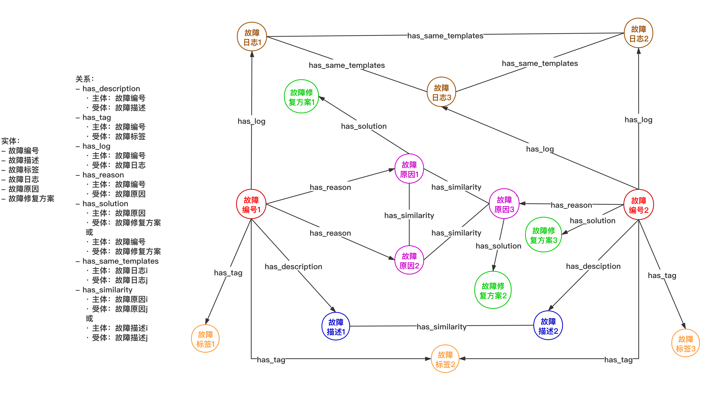

# 图谱构建

## 图谱本体结构

## 项目目录结构
1.data目录存放各种数据，详细说明如下：
```
- knowledge_extract_result目录下存放知识抽取结果
- knowledge_verify目录下存放知识校验相关文件
- log_data目录下存放日志处理相关文件
- similarity_calculate_data目录下存放文本相似度计算相关文件
- stackoverflow_hadoop_pages目录下存放爬取的tag为hadoop的页面
- thesaurus目录下存放模板中用到的所有触发词词库
- nltk_data目录下存放自然语言处理相关工具包
```
2.logparser目录下存放日志模板生成用到的模型程序，共14种

3.build_graph.py 程序读取并处理data目录下的相关图谱数据，生成图谱，存如neo4j数据库

4.get_graph_data_api.py 图谱可视化时用到的后端接口，接口读取neo4j数据库中的图谱数据封装后返回

5.knowledge_extract.py 知识抽取程序

6.knowledge_verify.py 知识校验程序，校验故障修复方案

7.log_template_extract.py 日志模板生成程序；当前使用的模型为LogSig，通过groupNum控制生成结果；logparser目录下有的模型都可以使用

8.similarity_calculate.py 文本相似度计算相关程序
## 项目运行
1.项目根目录下运行命令：
pip install -r requirements.txt

2.将data目录下的nltk_data目录移动到root目录下

3.运行knowledge_extract.py进行知识抽取

4.运行log_template_extract.py生成日志模板

5.运行similarity_calculate.py训练word2vec模型

6.在neo4j-community-3.5.18/bin目录下执行./neo4j start启动neo4j
```
浏览器访问localhost:7474，输入账号和密码，均为neo4j
```

7.运行build_graph.py生成图谱并存储到neo4j图数据库

8.运行get_graph_data_api.py开放图谱可视化所需要用的后端接口
