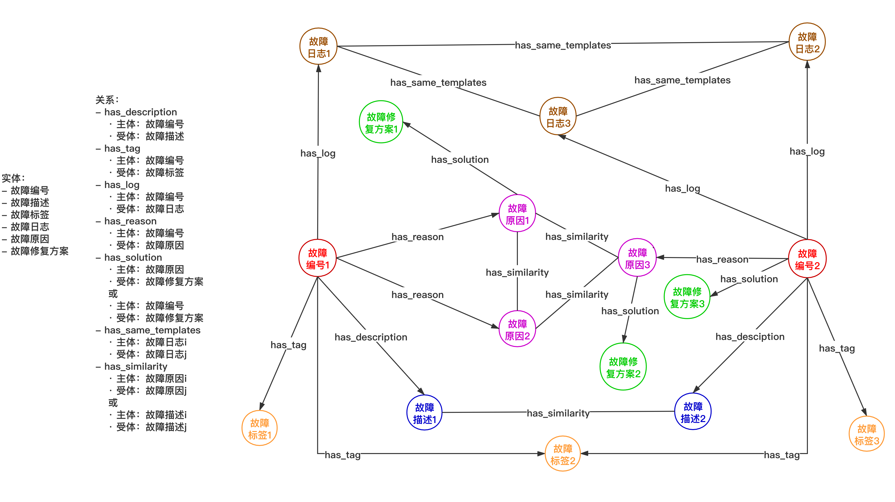

# AIOps-Event-Graph-WebData

## 项目介绍
将互联网IT问答社区（Stack Overflow）的故障页面作为数据源来构建不同领域的故障修复知识图谱用于智能运维平台中故障修复方案的提供，从而加快故障修复，进一步提升运维的效率和质量。

## 图谱本体模型


## 项目架构


## 目录结构
### stackoverflow-spider爬取Stack Overflow页面作为图谱构建的原始数据
-  data目录存放爬取的所有页面
```
例：./data/hadoop/中存放stackoverflow中tag为hadoop的所有页面
```
- stackoverflow目录为爬虫框架，具体说明如下：
```
./stackoverflow/spiders/stackoverflow_spiders.py: 
爬虫主程序；通过指定tag值来爬取某一tag下的所有页面，当前tag为hadoop;
注意：stackoverflow页面结构可能会发生变化，可能需要根据当下实际结构修改解析函数parse的实现
```
```
./stackoverflow/pipelines.py: 
处理每个爬取的页面的程序；每个页面按照序号命名并以html文件的格式存储在相应的位置
```
### FaultCorrectKG_build 图谱构建
- data目录存放各种数据，详细说明如下：
```
- knowledge_extract_result目录下存放知识抽取结果
- knowledge_verify目录下存放知识校验相关文件
- log_data目录下存放日志处理相关文件
- similarity_calculate_data目录下存放文本相似度计算相关文件
- stackoverflow_hadoop_pages目录下存放爬取的tag为hadoop的页面
- thesaurus目录下存放模板中用到的所有触发词词库
- nltk_data目录下存放自然语言处理相关工具包
```
- logparser目录下存放日志模板生成用到的模型程序，共14种

- build_graph.py 程序读取并处理data目录下的相关图谱数据，生成图谱，存如neo4j数据库

- get_graph_data_api.py 图谱可视化时用到的后端接口，接口读取neo4j数据库中的图谱数据封装后返回

- knowledge_extract.py 知识抽取程序

- knowledge_verify.py 知识校验程序，校验故障修复方案

- log_template_extract.py 日志模板生成程序；当前使用的模型为LogSig，通过groupNum控制生成结果；logparser目录下有的模型都可以使用

- similarity_calculate.py 文本相似度计算相关程序
### fault-correct-graph_front web端图谱展示
### neo4j-community-3.5.18 neo4j图数据库

## 环境
python_version = 3.6.8

## 运行
### 爬取stackoverflow中某一tag下的所有Q&A页面
```
1.cd stackoverflow-spider
2.pip install -r requirements.txt
3.cd stackoverflow/spiders
4.scrapy crawl stackoverflow-hadoop(其中stackoverflow-hadoop为爬虫项目名，与spiders/stackoverflow_spiders.py中指定的name一致)
```
### 图谱构建
```
1.cd FaultCorrectKG_build
2.pip install -r requirements.txt
3.mv ./data/nltk_data /root/
4.运行knowledge_extract.py进行知识抽取
5.运行log_template_extract.py生成日志模板
6.运行similarity_calculate.py训练word2vec模型
7.在neo4j-community-3.5.18/bin目录下执行./neo4j start启动neo4j(浏览器访问localhost:7474，输入账号和密码，均为neo4j)
8.运行build_graph.py生成图谱并存储到neo4j图数据库
9.运行get_graph_data_api.py开放图谱可视化所需要用的后端接口
```
### 图谱可视化
```
1.npm install
2.npm run serve
```
